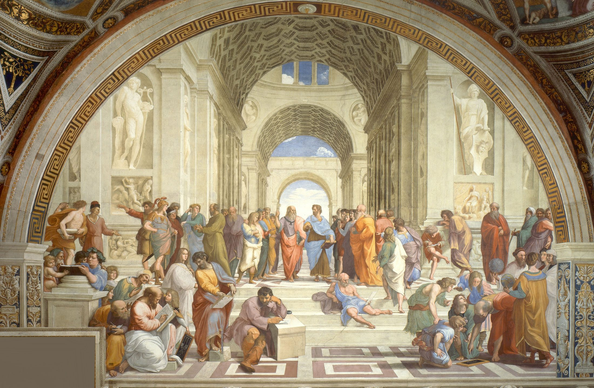

# Chapter Authoring Guidelines
## *Computing and AI Ethics* — HTML Ebook Edition

> These guidelines govern how new chapters are written and formatted for the
> HTML ebook. Every chapter must follow these conventions so the book reads
> as a coherent whole, even across different authors or revision sessions.

---

## 1. Relationship to the Lecture Slides

Each HTML chapter is **based on** its corresponding lecture file but is **not**
a conversion of it. The relationship is:

| Lecture slides | HTML chapter |
|---|---|
| Bullet-point summaries | Full explanatory paragraphs |
| TikZ diagrams | Mermaid / SVG / public-domain figures |
| Single-slide arguments | Argument boxes + prose discussion |
| Brief thinker intros | Full Key Thinker biographical cards |
| 3–5 discussion prompts | Thought Questions box per section |
| Central Questions frame | Central Questions section at top |

**Same learning outcomes, richer treatment.** The Central Questions that open
each lecture should appear verbatim (or very closely) at the top of the HTML
chapter. Section and subsection structure should mirror the lecture's sections.


## 2. Audience and Writing Level

Write for an **intelligent, motivated high-school senior or first-year college
student** who:
- Has no prior background in philosophy or computer science.
- Is comfortable reading and thinking carefully.
- May not have a stable internet connection, so the chapter must be
  self-contained.

**Practical rules:**

- Define every technical or philosophical term the first time you use it,
  using a `.definition-box`.
- Prefer concrete examples before abstract principles.
- Use the second person ("you") sparingly and only for direct engagement.
- Avoid jargon; if you must use it, explain it immediately.
- Aim for sentences of 20–30 words on average; vary rhythm.
- Each section should be readable in ~10 minutes (~800–1,200 words of prose).


## 3. Chapter Structure

Every chapter uses this skeleton (see `chapter-template.html`):

```
Top navigation bar
Chapter header (chapter number, title, subtitle)
Table of contents box
Central Questions section
Section 1
  prose, definitions, key thinker, quote, argument, case study, thought questions
Section 2
  prose, definitions, key thinker, quote, argument, case study, thought questions
Section 3
  prose, diagrams, tables, thought questions
...
Summary / Key Points section
Chapter footer navigation
```

**Minimum content per chapter:**
- 4–6 Central Questions
- 3–5 major sections
- 2–4 Key Thinker cards
- 3–5 Argument ("What's the Argument?") boxes with prose discussion
- 3–5 Case Studies
- 1 Thought Questions box per section
- 1–3 diagrams (Mermaid or SVG)
- 1–2 tables
- 1 Key Points summary (6–10 bullets)


## 4. File Naming and `<body>` Attributes

| Chapter | Filename | `data-chapter` |
|---|---|---|
| 1 — History of IT Ethics | `ch01_history.html` | `1` |
| 2 — Virtue Ethics | `ch02_virtue_ethics.html` | `2` |
| 3 — Free Speech | `ch03_free_speech.html` | `3` |
| 4 — Intellectual Property | `ch04_intellectual_property.html` | `4` |
| 5 — Cryptography | `ch05_cryptography.html` | `5` |
| 6 — Privacy | `ch06_privacy.html` | `6` |
| 7 — AI Ethics | `ch07_ai_ethics.html` | `7` |
| 8 — Work & Automation | `ch08_work_automation.html` | `8` |

The `data-chapter` attribute on `<body>` selects the chapter's accent color
automatically via CSS custom properties — always set it correctly.


## 5. Special Elements Reference

### 5.1 Central Questions

```html
<section class="central-questions" id="central-questions"
         aria-labelledby="cq-heading">
  <h2 id="cq-heading">Central Questions</h2>
  <ol>
    <li>What is …?</li>
    <li>How did … shape …?</li>
    <li>What arguments do philosophers give for …?</li>
    <li>How does … apply to …?</li>
    <li>What are the strongest objections to …?</li>
  </ol>
</section>
```

- Match the learning outcomes from the corresponding lecture.
- 4–6 questions, phrased as genuine open questions (not "be able to list…").
- Italic phrasing is fine; they should feel inviting, not like exam objectives.

---

### 5.2 What's the Argument? (Argument Box)

```html
<div class="argument-box">
  <p class="box-label">What's the Argument?</p>
  <p class="box-title">The [Name] Argument</p>
  <ol class="premises">
    <li>Premise 1</li>
    <li>Premise 2</li>
    <li>Premise 3 (if needed)</li>
  </ol>
  <div class="conclusion">
    <span class="therefore">&#8756;</span>
    Conclusion
  </div>
</div>
```

- **Always** follow the box with a paragraph of prose explaining the argument
  in plain English.
- Name every argument (e.g., "The Harm Principle Argument", "Socrates's Memory
  Argument"). Names should be descriptive and memorable.
- Premises should be complete sentences and independently defensible.
- Use `∴` (the "therefore" symbol, `&#8756;`) before the conclusion.
- If there are counter-arguments, follow with `.pro-argument` / `.objection`
  boxes (see §5.9).

---

### 5.3 Key Thinker Card

```html
<div class="key-thinker">
  <!-- Option A: with a portrait image (public domain / CC licensed only) -->
  

  <!-- Option B: placeholder emoji (when no image is available) -->
  <div class="thinker-portrait-placeholder" aria-hidden="true">🧠</div>

  <div class="thinker-header">
    <p class="thinker-label">Key Thinker</p>
    <h3 class="thinker-name">
      Full Name
      <span class="thinker-dates">(1748–1832)</span>
    </h3>
  </div>

  <div class="thinker-body">
    <p>Bio paragraph 1 …</p>
    <p>Bio paragraph 2 …</p>
  </div>
</div>
```

**Portrait images:**
- Place images in `html/images/`.
- Use only public domain or openly licensed images (Wikimedia Commons is a
  reliable source). Note the source in an HTML comment.
- Keep images small (max ~300×300 px, JPEG at 80% quality); the CSS caps
  display at 96×96 px.

**Bio content:**
- Paragraph 1: who they were — nationality, dates, major works, context.
- Paragraph 2: their specific contribution to this chapter's topic.
- Paragraph 3 (optional): legacy, controversies, or contemporary relevance.
- Aim for 150–250 words total. This is a sidebar, not a Wikipedia article.

---

### 5.4 Case Study

```html
<div class="case-study">
  <p class="box-label">Case Study</p>
  <p class="box-title">Descriptive Title (Year or Date Range)</p>
  <p>Background paragraph …</p>
  <p>What happened and why it was ethically significant …</p>
  <p>Outcome and lessons …</p>
</div>
```

- Use **real cases** whenever possible. Label hypotheticals explicitly:
  `<p class="box-title">Hypothetical: …</p>`.
- Include dates, parties, and enough technical context for the reader to
  understand what was at stake.
- End with a clear connection back to the section's conceptual point.
- 150–300 words per case study.

---

### 5.5 Thought Questions

```html
<div class="thought-questions">
  <p class="box-label">Thought Questions</p>
  <ol>
    <li>Open question 1 …</li>
    <li>Open question 2 …</li>
    <li>Open question 3 …</li>
  </ol>
</div>
```

- Place at the end of each major section, before the next `<h2>`.
- 3–5 questions per box.
- Questions should be **genuinely open** — no single correct answer.
- Include a mix of: abstract (apply the concept), personal (connect to your
  experience), and steelman (argue for the opposing view) questions.

---

### 5.6 Key Points

```html
<div class="key-points">
  <p class="box-label">Key Points</p>
  <ul>
    <li><strong>Key term:</strong> one-sentence summary.</li>
    <li><strong>Thinker's name</strong> argued that …</li>
    <li><strong>Argument name:</strong> premise … therefore …</li>
    <li><strong>Case study:</strong> illustrates …</li>
  </ul>
</div>
```

- Always the last substantive element before the chapter footer.
- 6–10 bullets, each a complete sentence.
- Bold the key term, thinker, or argument name at the start of each bullet.

---

### 5.7 Quote Block

```html
<blockquote class="quote-block">
  <p>
    The quotation goes here, reproduced accurately, without the opening
    and closing quotation marks (the CSS adds them automatically).
  </p>
  <cite>Author Name, <em>Work Title</em> (year)</cite>
</blockquote>
```

- Use for significant direct quotations (not paraphrases).
- Keep quotes under 60 words where possible — this is an ebook, not an anthology.
- Always follow with a paragraph explaining the quote's relevance.
- The CSS automatically adds opening and closing curly quotes; do **not** add
  `"` inside the `<p>` tag.

---

### 5.8 Definition Box

```html
<div class="definition-box">
  <p class="term">Term</p>
  <p class="definition">Clear, accessible definition in 1–2 sentences.</p>
</div>
```

- Use the first time a key technical or philosophical term is introduced.
- One term per box.
- After the box, continue your prose — don't just move on as if the box
  was sufficient.

---

### 5.9 Pro-Argument and Objection

```html
<div class="pro-argument">
  <p class="box-label">Supporting argument</p>
  <p>A reason to accept the preceding argument …</p>
</div>

<div class="objection">
  <p class="box-label">Objection</p>
  <p>The strongest reason to reject or qualify the argument …</p>
</div>
```

- Always present the strongest version of each side (charitable interpretation).
- These pair naturally with `.argument-box` but can also stand alone.
- Follow the pair with prose that weighs the considerations.

---

### 5.10 Tables

```html
<div class="table-wrapper">
  <table>
    <caption>Table N.N — Descriptive title</caption>
    <thead>
      <tr>
        <th scope="col">Column 1</th>
        <th scope="col">Column 2</th>
      </tr>
    </thead>
    <tbody>
      <tr><td>Row label</td><td>Data</td></tr>
    </tbody>
  </table>
</div>
```

- Always wrap in `.table-wrapper` (enables horizontal scroll on mobile).
- Always include a `<caption>` (accessibility + context).
- Use `scope="col"` on `<th>` elements.
- First column is styled as a label column; use it for categories/names.
- Follow with a short paragraph drawing attention to the most important pattern.


## 6. Citations and Bibliography

The ebook reuses `refs.bib` from the project root — the same file used by the
LaTeX lecture slides. There is no separate bibliography to maintain.

### 6.1 How it works

`cite.js` is included in every chapter via `<script src="cite.js" defer></script>`.
On page load it:
1. Fetches `../refs.bib` from the project root.
2. Parses the BibTeX and builds an in-memory database.
3. Replaces every `<cite data-key="…">` element with a formatted APA inline
   citation that links to the reference list.
4. Populates `<div id="bibliography">` with a sorted reference list of all
   cited sources.

### 6.2 Inline citations

Use `<cite data-key="bibtex_key">` anywhere in the prose.
Use the **same BibTeX keys** as in the LaTeX files — e.g. `\textcite{plato_phaedrus}`
in LaTeX becomes `<cite data-key="plato_phaedrus"></cite>` in HTML.

```html
<!-- Inside a sentence: -->
<p>
  Socrates famously worried that writing would weaken memory
  <cite data-key="plato_phaedrus"></cite>.
</p>

<!-- Inside a blockquote: -->
<blockquote class="quote-block">
  <p>The quotation text…</p>
  <cite data-key="plato_phaedrus"></cite>
</blockquote>

<!-- Parenthetical at end of paragraph: -->
<p>
  This argument is developed at length in the secondary literature
  <cite data-key="macintyre_after_virtue"></cite>.
</p>
```

Rendered output: `(Plato, 1925)` — linked to the reference entry.

### 6.3 Reference list

Place this block at the end of every chapter, just before the footer.
`cite.js` fills it automatically; do not edit it manually.

```html
<section id="references-section" aria-labelledby="refs-heading">
  <h2 id="refs-heading">References</h2>
  <div id="bibliography"></div>
</section>
```

Only the references actually cited in the chapter are included. They are sorted
alphabetically by first author's last name.

### 6.4 Adding new entries to refs.bib

Add new entries directly to `../refs.bib` in the project root using standard
BibTeX format. The same entry will then be available to both the LaTeX slides
and the HTML chapters. Use the entry type that fits best:

| Entry type | Use for |
|---|---|
| `@book` | Books, edited volumes, translated classics |
| `@article` | Journal articles, magazine features |
| `@report` | Institutional reports, government documents |
| `@misc` | Websites, manifestos, laws, letters |
| `@inproceedings` | Conference papers |
| `@incollection` | Book chapters |

**Corporate / institutional authors** must use double braces so the author
name is not parsed as "Last, First":
```bibtex
author = {{Pew Research Center}},
```

### 6.5 Local development

`cite.js` uses `fetch()` to load the `.bib` file, which requires a web server.
Opening `chapter.html` directly with `file://` will silently skip citations.

Start a local server in the project root:
```bash
# Python (built-in)
python -m http.server 8000
# Then open: http://localhost:8000/html/ch01_history.html

# Node (if installed)
npx serve .
```

Or use the **VS Code Live Server** extension — right-click any HTML file →
"Open with Live Server".

Unknown citation keys are highlighted in red in the browser so errors are
immediately visible during authoring.


## 7. Images

### 7.1 Available images

The `/images/` directory at the project root holds public-domain or
openly-licensed images already downloaded for the project. Reference them
from HTML files with the path `../images/filename.jpg`.

| File | Subject | Notes |
|---|---|---|
| `ada_lovelace.jpg` | Ada Lovelace | Portrait, public domain |
| `alan_turing.jpg` | Alan Turing | Portrait |
| `aristotle_bust.jpg` | Aristotle | Marble bust, public domain |
| `cuneiform_tablet.jpg` | Ancient cuneiform tablet | Public domain |
| `edison.jpg` | Thomas Edison | Portrait, public domain |
| `gutenberg_bible.jpg` | Page from a Gutenberg Bible | Public domain |
| `hannah_arendt.jpg` | Hannah Arendt | Portrait |
| `john_stuart_mill.jpg` | John Stuart Mill | Portrait, public domain |
| `karl_marx.jpg` | Karl Marx | Portrait, public domain |
| `luddites_1812.jpg` | Luddite engraving (1812) | Historical illustration, public domain |
| `lydian_coin.jpg` | Ancient Lydian coin | Public domain |
| `nsa_headquarters.jpg` | NSA headquarters aerial | U.S. government, public domain |
| `panopticon.jpg` | Panopticon diagram | Bentham's original plan, public domain |
| `plato_bust.jpg` | Plato | Marble bust (Capitoline Museums), public domain |
| `power_loom.jpg` | Industrial power loom | Historical illustration, public domain |
| `raphael_school_athens.jpg` | *The School of Athens* (Raphael) | Public domain |
| `ray_bradbury.jpg` | Ray Bradbury | Portrait |
| `samuel_morse.jpg` | Samuel Morse | Portrait, public domain |
| `yap_stone_money.jpg` | Yap stone money (Rai stones) | Public domain |

Add new images to this table when you add them to the directory.

### 7.2 Using images in HTML

```html
<figure>
  
  <figcaption>
    Raphael, <em>The School of Athens</em> (c. 1509–1511), Apostolic Palace, Vatican.
    Public domain.
  </figcaption>
</figure>
```

- Path from `html/chNN_*.html` to images is always `../images/`.
- Write meaningful `alt` text: describe the image content, not just the subject name.
- Always include a `<figcaption>` with title, date, and "Public domain" or license.
- For Key Thinker portrait cards, use `class="thinker-portrait"` on the ``
  instead of the placeholder div (see §5.3).

### 7.3 Higher-quality infographics

SVG and PNG infographics placed in `/images/` are referenced the same way.
For SVG files, prefer inline SVG (paste the SVG code directly into the HTML)
when the diagram uses the book's color palette and needs to be responsive.
Use an `` tag when the SVG is a fixed-size external asset.


## 8. Diagrams

### 8.1 Mermaid (preferred for logical/conceptual diagrams)

Use Mermaid for flowcharts, concept maps, timelines, and sequence diagrams.
The Mermaid script is already included in `chapter-template.html`.

```html
<figure>
  <div class="mermaid">
flowchart TD
    A[Concept A] --> B[Concept B]
    B --> C{Decision?}
    C -->|Yes| D[Outcome 1]
    C -->|No|  E[Outcome 2]
  </div>
  <figcaption>Figure N.N — Caption explaining the diagram.</figcaption>
</figure>
```

**Useful Mermaid diagram types for this textbook:**

| Type | Use case | Syntax starter |
|---|---|---|
| Flowchart | Arguments, processes, decisions | `flowchart LR` or `TD` |
| Timeline | Historical sequences | `timeline` |
| Quadrant | Comparing two axes | `quadrantChart` |
| Graph | Concept relationships | `graph LR` |
| Sequence | Interactions between parties | `sequenceDiagram` |

**Timeline example:**
```
timeline
    title Five Information Revolutions
    3200 BCE : Writing invented in Mesopotamia
    1440     : Gutenberg printing press
    1837     : Morse telegraph
    1969     : ARPANET (early Internet)
    2004     : Social media era begins
```

**Keep diagrams simple.** If a Mermaid diagram requires more than ~15 nodes,
consider splitting it or using a different presentation.

### 8.2 Inline SVG (for custom or polished diagrams)

For diagrams that need precise layout or custom styling, write inline SVG
directly in the HTML:

```html
<figure>
  <svg viewBox="0 0 600 200" xmlns="http://www.w3.org/2000/svg"
       role="img" aria-label="Description of diagram">
    <title>Short title for screen readers</title>
    <!-- SVG content here -->
  </svg>
  <figcaption>Figure N.N — Caption.</figcaption>
</figure>
```

Use these colors to match the book's visual language:
- Primary blue: `#1a4a8a`  |  Gold: `#c8961c`  |  Green: `#2e7d32`
- Red: `#c62828`  |  Purple: `#6a1b9a`  |  Gray: `#546e7a`

### 8.3 No TikZ

The lecture files use TikZ diagrams. Do **not** copy TikZ code into HTML
chapters. Recreate the diagram's idea in Mermaid or SVG instead — this
produces diagrams that are more detailed, accessible, and responsive.


## 10. Navigation Links

Every chapter must have:

1. **Top nav** (`<nav class="top-nav">`):
   - Home link to `index.html`
   - Previous chapter link (remove if Chapter 1)
   - Chapter number display
   - Next chapter link (remove if Chapter 8)

2. **Footer nav** (`.chapter-footer-nav`):
   - "← Previous chapter" button
   - "⌂ Table of Contents" button
   - "Next chapter →" button
   - For ch01: make the Previous button `.disabled`
   - For ch08: make the Next button `.disabled`

Update both sets of links whenever a new chapter is added.


## 11. Accessibility Checklist

Before marking a chapter ready:

- [ ] All images have non-empty, descriptive `alt` text
- [ ] All `<figure>` elements have `<figcaption>`
- [ ] All `<table>` elements have `<caption>` and `scope` attributes on `<th>`
- [ ] All section headings have unique `id` attributes (for TOC links)
- [ ] `aria-labelledby` connects `<section>` to its `<h2>` where possible
- [ ] Color is not the only way information is conveyed (labels, not just colors)
- [ ] Mermaid diagrams have a surrounding `<figure>` with `<figcaption>`
- [ ] SVG images include `role="img"` and `<title>` elements
- [ ] `lang="en"` is set on `<html>`
- [ ] Page has a logical heading hierarchy (h1 → h2 → h3, no skipping)
- [ ] All `<cite data-key="…">` elements resolve without red errors (test via local server)
- [ ] `<div id="bibliography">` is present and populated with citations
- [ ] Image paths use `../images/` (not `images/` or absolute paths)


## 12. Quality and Style

### Do
- Write full, flowing paragraphs before and after every special element.
- Use specific historical examples and named people.
- Present multiple perspectives before offering a conclusion.
- Acknowledge genuine uncertainty — not every question has a settled answer.
- Link concepts back to the Central Questions throughout the chapter.
- Use transitions between sections ("Having examined X, we turn to Y…").

### Don't
- Start a section with a bullet list before establishing the topic in prose.
- Use passive voice excessively ("It was argued that…" → "Aristotle argued that…").
- Plagiarize Wikipedia; paraphrase and cite instead.
- Add unsourced empirical claims ("Studies show…") without a reference.
- Write more than two consecutive paragraphs without a visual break
  (use a definition, quote, or heading).
- Leave placeholder text in the published file.

### Prose length targets
| Element | Target length |
|---|---|
| Section opening | 3–5 paragraphs before the first box |
| Key Thinker bio | 150–250 words |
| Case Study | 150–300 words |
| Post-argument discussion | 1–2 paragraphs |
| Total chapter | 4,000–7,000 words of prose |


## 13. Workflow for a New Chapter

1. **Read** the corresponding `.tex` lecture file to extract:
   - Central Questions
   - Section and subsection titles
   - Key thinkers mentioned
   - Arguments (look for `\begin{argument}...\end{argument}`)
   - Case studies (look for `casestudybox` environments)
   - Discussion questions (look for `discussionbox`)

2. **Copy** `chapter-template.html` to the correct filename.

3. **Set** `data-chapter="N"` on `<body>`.

4. **Fill in** the header, table of contents, and Central Questions.

5. **Write** each section in order, working through the lecture's content
   and expanding every bullet point or frame into full prose.

6. **Add** Key Thinker cards, Argument boxes, Case Studies, and Thought
   Questions as you go — don't batch them at the end.

7. **Create diagrams** to replace any TikZ figures from the lecture.

8. **Complete** the Key Points summary last, once you know what you've covered.

9. **Update** prev/next navigation links in both the top nav and footer.

10. **Run** the accessibility checklist (§8) before committing.
